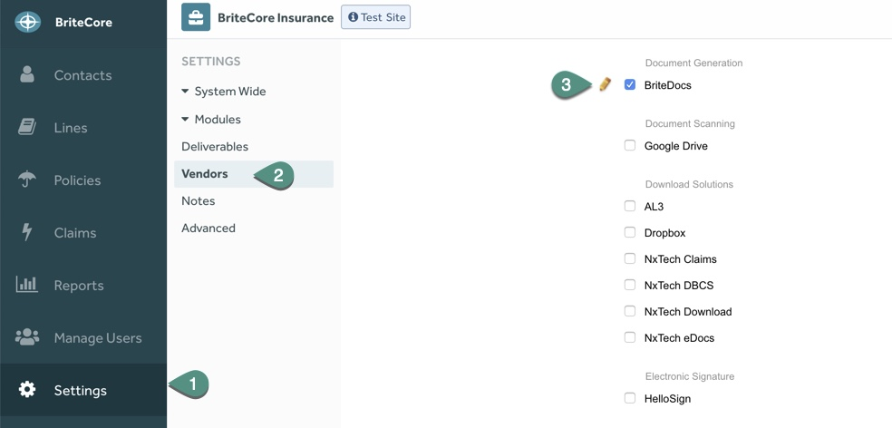

BriteDocs Workflows and Tasks

Settings 

# Settings Overview

This section describes BriteDocs settings in BriteDocs. There are three main tasks associated with settings:

1. Turn on Document Generation

2. Data Mapping   

3. Associate BriteDocs deliverables to BriteCore

#  Turn on Document Generation

			

To turn on Document Generation:

1. In the BriteCore sidebar, click **Settings**. 

2. In the Settings sidebar, click **Vendors**.

3. Under **Document Generation**, select** BriteDocs**.

**Figure 2: **Save Changes

1. Scroll down and click **Save **to confirm changes.

# Data Mapping 

Data mapping allows administrators to insert data from remote services into BriteDocs templates. The BriteDocs support team sets up data points for all clients before the go-live date. 

The data mapping process includes:

1. Data mapping is enabled via AWS AppSync.

2. AppSync reaches out to other services (such as BriteCore or BriteLines) to retrieve data using customized resolvers.

3. The resolvers locate remote data fields and apply any necessary formatting or transformation.

4. AppSync then exposes this data as a GraphQL API, which BriteDocs uses.

All available data points are shown in the BriteDocs UI in a tree view. Deliverables will now contain dynamically populated data. 

**Figure 3: **Available Datapoints Tree View 

# Associate BriteDocs Deliverables to BriteCore

**Note:** This task is a temporary step in transitioning from BriteCore Gen2 to Gen3

There are old stock deliverables still in use within BriteCore (Gen2). When you create a new/customized template using BriteDocs, you must associate it with the existing deliverable in Gen 2. When you associate a new/customized template to existing attachments in the system it enables: 

1. BriteCore Gen2 to call BriteDocs when it attempts to generate a document .

2. BriteDocs to push the new template back to BriteCore Gen2.

3. Seamless transition from the user perspective. The attachments appear as expected and will be updated behind the scenes. 

There are three steps related to this task:

1. Copy the Report ID of stock deliverable in Gen2.

2. Copy the Deliverable ID of new template in BriteDocs.

3. Associate the Document in BriteCore.

## Copy the Report ID

	Copy the **Report ID **for the stock deliverable from the **Client Gen2** database.

## Copy the Deliverable ID 

**Figure 4: **Navigating to Deliverables section

To find  **Deliverable ID:**

1. In the BriteCore sidebar, click **Settings**.

2. In the Settings sidebar, click **Deliverables**. 

3. Scroll to the **Deliverables** section and click the pencil icon for the deliverable you want to associate in BriteCore.

**Figure 5: **Identifying Deliverable ID 

1. On your browser address bar, copy the **Deliverable ID **after the expression *deliverableid=*.** **In **Figure 5** the **Deliverable ID** is: 

*af817868-e945-11e0-8b59-0022191d98e1&stateId=339ff897-8c0e-11de-b1cc-000c2976c0ee.*

## Associate a Document in BriteCore 

To associate a Document in BriteCore:

**Figure 10: **Navigate to Resources 

1. In the top-right of the screen, click your** **profile icon.

2. In the profile list, click **Resources.**

**Figure 6: **Navigating to Resources

**Figure 7: **Navigating to Support Tools 

1. In the **Resources** list, click **Support Tools. **

**Figure 8: **Navigating to Associate a Deliverable with BriteDocs 

1. In the **Choose a tool to use **section, click **Associate A Deliverable with BriteDocs.**

**Figure 9: **Associate a Deliverable with BriteDocs 

1. Type the[ Report ID](#bookmark=id.flrkahojr427).

2. Type  the [ BriteDocsID](#bookmark=id.xdka8me5m0cl)**.**

3. Click **Associate.** 

